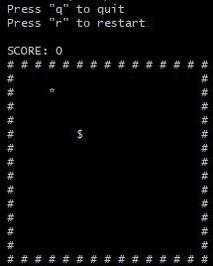

# snake-terminal-nodejs



## how to play

### clone the repository
```bash
git clone https://github.com/gabrielmissio/snake-terminal-nodejs.git
```

### start the game
```bash
node src/main
```

### commands

```properties
directions
4 -> left
6 -> right
8 -> up
2 -> down

options
q -> quit
r -> restart
```
